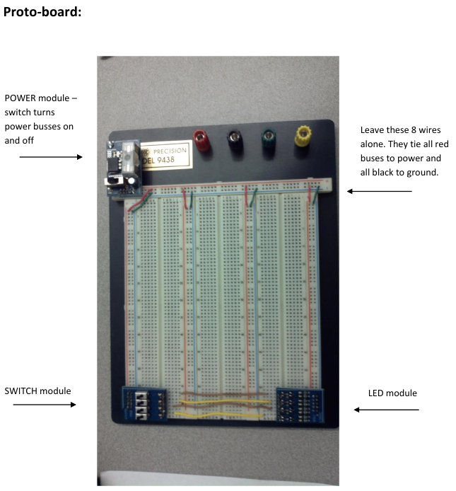

# Introduction

In this lab we will dive more into how each of the logic gates function, and find out why we can actually replace everything we use with just the NAND gate. In addition, we will explore *why* replacing everything with the NAND gate is actually a great idea.

## Discussing Resource Usage

For any given logic circuit, be they in an FPGA or otherwise, we will need to use a certain combination of logic gates. These gates, as you've seen in your class, are built out of physical transistors, and as such, are constrained in their total count within any given system. Therefore, there's a limit to how complicated any solution can grow and still fit within the requirements of the system. Therefore, using resources wisely is an extremely important skill for digial logic designers.

When making an FPGA chip, the designers have to make a guess at the circuits their customers will design and place on the chip. They can't know exactly the circuit any engineer will design, and thus have to intelligently use up physical die space in the most efficient way possible. This begs the question -- how do we divvy up how many AND, OR, NOT, etc gates are present on the chip? What if someone has an OR heavy design? Or a AND heavy design? The FPGA may end up being extremely ineffective in some use cases.

Thankfully, FPGA designers don't actually have to make this tradeoff. There are logic gates known as Universal Gates that can be recombined to produce the effect of any other logic gate. They are the NAND and the NOR gates. By using just NAND or NOR gates, you can make the equivalent of *any* logic circuit. Let's see how below.

## The Universal Gates

For a refresher, here's the NAND and NOR gate truth tables below:

| A   | B   | ~(A & B) |
| --- | --- | -------- |
| 0   | 0   | 1        |
| 0   | 1   | 1        |
| 1   | 0   | 1        |
| 1   | 1   | 0        |

| A   | B   | ~(A \| B) |
| --- | --- | --------- |
| 0   | 0   | 1         |
| 0   | 1   | 0         |
| 1   | 0   | 0         |
| 1   | 1   | 0         |

To understand how these gates are universal, we need to use DeMorgan's rule. It says:

```
~(A & B) = ~A | ~B (Eqn 1)
~(A | B) = ~A & ~B (Eqn 2)
```

Let's introduce two more truth tables below to prove this:

Eqn 1:
| A   | B   | ~(A & B) | ~A \| ~B |
| --- | --- | -------- | -------- |
| 0   | 0   | 1        | 1        |
| 0   | 1   | 1        | 1        |
| 1   | 0   | 1        | 1        |
| 1   | 1   | 0        | 0        |

Eqn 2:
| A   | B   | ~(A \| B) | ~A & ~B |
| --- | --- | --------- | ------- |
| 0   | 0   | 1         | 1       |
| 0   | 1   | 0         | 0       |
| 1   | 0   | 0         | 0       |
| 1   | 1   | 0         | 0       |


We can see from the truth tables that these are equivalent. This means we have a way to directly convert from some kind of AND gate to an OR gate, and vice versa. However, there's lots of inversions present that need to be done to make this happen. Thankfully, the NAND and NOR gates can easily act as inverters. If we apply a single signal to both A and B inputs of a NAND or NOR gate, the output will "invert" see the rows in the NAND and NOR truth tables where `A == B`:

| A   | A   | ~(A & A)   |
| --- | --- | ---------- |
| 0   | 0   | 1          |
| 0   | 1   | IMPOSSIBLE |
| 1   | 0   | IMPOSSIBLE |
| 1   | 1   | 0          |

| A   | A   | ~(A \| A)  |
| --- | --- | ---------- |
| 0   | 0   | 1          |
| 0   | 1   | IMPOSSIBLE |
| 1   | 0   | IMPOSSIBLE |
| 1   | 1   | 0          |

That means each of these gates with their inputs tied together act as an inverter. Now, with DeMorgan's rule and the inverting capability of our gates, we can transform any logic circutit into just NAND or NOR gates.

## Assignment

In this lab, you will be asked to physically implement the following equation with a 4-NAND chip:

`f = (A & ~B) | (C & D)`

Use DeMorgan's law with the information above to turn this equation into something that only uses NAND gates, then use the breadboard and chip provided by the lab instructor to physically wire this circuit up.

### Breadboard Information

Overview: 


Wiring guidance:
